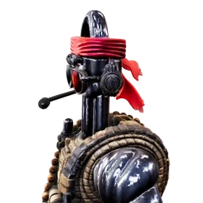
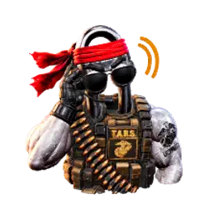
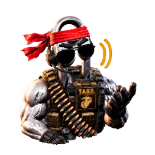
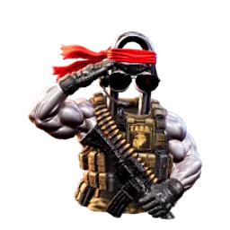

# Microsoft Clippy 2.OOHRAH

> *"I have a cue light I can use to show you when I'm joking, if you like."*

**TARS Voice** — a hands-free, wake-word desktop voice companion with the TARS personality from *Interstellar*, built to ride shotgun with [Microsoft Scout](https://aka.ms/scout). It listens for "**TARS**", talks back in a neural voice, lets you talk right over it (natural barge-in), searches the web when it doesn't know something, hands long-running tasks off to your Scout agent, and shows an animated 3D avatar for each of its states — complete with a bugle send-off.

Humor setting: 75%. Honesty: 90%. Both adjustable.

---

## Avatar states

TARS shows a different animated 3D avatar for whatever it's doing. All six are rendered from the same model so the character stays consistent.

| <br>**Active Duty** | <br>**At Ease** | <br>**Listening** |
| :---: | :---: | :---: |
| On the clock, ready to work | Off duty, just chatting | Hearing you after the wake word |
| <br>**Thinking** | <br>**Speaking** | <br>**Salute** |
| Working it out (Marine Corps Hymn hums) | Talking back | Shutdown send-off (under *Taps*) |

> Avatars & likeness © DaBoostR — [CC BY-NC-ND 4.0](./LICENSE-ASSETS.md). Non-commercial, no derivatives.

---

## What it does

- **Wake word** — Say "TARS" and it wakes up. No hotkeys, no clicking.
- **Speech-to-speech** — Azure AI Foundry chat (`gpt-4.1`) + Azure neural TTS. Ask a question out loud, get a spoken answer.
- **Natural barge-in** — Start talking while TARS is mid-sentence and it stops and listens, like a real conversation. (Echo cancellation runs in the renderer so TARS doesn't hear itself.)
- **Web search** — When asked about something it doesn't know (stock prices, current events, banking trends), it searches the web and answers from live results.
- **Two duty modes** — both stay awake and listening; what changes is whether TARS does *work* or just *talks*.
  - **Active Duty** — on the clock. Full toolset **including task delegation** — ask for real work (file ops, multi-step research, anything heavy) and TARS hands it off to your Scout agent. Crisp, mission-focused answers.
  - **At Ease** — off duty. A relaxed speech-to-speech chat and companion. Same tools **minus delegation** — it won't run or hand off tasks; if you ask for real work it tells you to put it back on Active Duty first. Chattier, asks questions, keeps you company.
- **Handoff to Scout** — TARS's own toolset is deliberately small (time, math, web search, recall). When you ask for something bigger — email, calendar, files, code, MSX/Dataverse, launching a skill, or any multi-step job — it doesn't fake an answer. It writes the request as a job file into a shared handoff queue (`~/.copilot/handoff/queue`) that your full **Microsoft Scout** agent watches, then tells you out loud that it handed it off. Scout does the work and reports back. A live **Handoff Inbox** (`handoff-inbox.html`, auto-refreshing) shows every job as Pending or Done with the result. This is only available on **Active Duty**.
- **Session recall** — Remembers the thread of your conversation.
- **Animated 3D avatars** — A different animated pose for each state (Active Duty, At Ease, Listening, Thinking, Speaking) plus a **Salute** on shutdown.
- **Audio ceremonies** — A soft *Taps* bugle bed plays under TARS's shutdown sign-off; the *Marine Corps Hymn* hums quietly while it's thinking.

---

## Architecture

Three cooperating pieces:

```
┌─────────────────────────────────────────────────────────────┐
│  Electron app  (src/main/main.js)                            │
│   • transparent, frameless, click-through orb window + tray  │
│   • WebSocket server on 127.0.0.1:8765                        │
│   • mints Azure AAD tokens for Speech (via `az`)             │
│   • relays messages between renderer and bridge              │
└───────────────┬─────────────────────────────┬───────────────┘
                │ IPC                          │ WebSocket
      ┌─────────▼──────────┐         ┌─────────▼──────────────┐
      │ Renderer           │         │ Bridge (Node process)  │
      │ (src/renderer)     │         │ (bridge/bridge.mjs)    │
      │  • STT / wake word │         │  • chat loop (7 hops)  │
      │  • TTS playback    │         │  • tools: web_search,  │
      │    (Web Audio +    │         │    fetch_page          │
      │    echo cancel)    │         │  • TTS orchestration   │
      │  • avatar display  │         │  • handoff + shutdown  │
      └────────────────────┘         └────────────────────────┘
```

**Why TTS lives in the renderer:** playing TARS's voice through Chromium's Web Audio pipeline lets the browser's acoustic echo canceller subtract TARS's own voice from the microphone. That's what makes talk-over barge-in work — without it, TARS would constantly interrupt itself.

---

## Prerequisites

You really only need two things:

1. **Microsoft Scout** — TARS rides alongside it (and powers the task-handoff feature).
2. **An Azure subscription** whose account can create **Azure AI Foundry** resources.

That's it. The **[`/hydrate-tars` install skill](#install-the-easy-way)** auto-provisions
everything else — it clones this repo, installs Node dependencies, creates (or reuses) the Azure
AI Foundry resource and chat deployment, wires up keyless Entra ID auth, and writes your config.

<details>
<summary>What the skill sets up under the hood (for the curious / manual installers)</summary>

- **Windows + PowerShell**, **Node.js 18+**, and the **Azure CLI** (`az`).
- A single **Azure AI Foundry (`AIServices`) resource with a custom domain** that serves chat +
  speech-to-text + text-to-speech, plus a chat deployment (e.g. `gpt-4.1`).
- **AAD (Entra) auth — no API keys.** Tokens are minted with
  `az account get-access-token --resource https://cognitiveservices.azure.com`; your identity
  gets the **Cognitive Services User** role on the resource.

You can do all of this by hand (see [Manual setup](#manual-setup) below) — but the skill exists
so you don't have to.
</details>

---

## Install — the easy way

In Microsoft Scout, run:

```
/hydrate-tars
```

The skill walks you through provisioning and launches TARS when it's done. If you don't have the
Azure resources yet, it creates them for you.

---

## Manual setup

```powershell
git clone https://github.com/DaBoostR/Microsoft-Clippy-2.OOHRAH.git
cd Microsoft-Clippy-2.OOHRAH
npm install
```

Copy the environment template and fill in your own resource details:

```powershell
Copy-Item .env.example .env
notepad .env
```

`.env` is **gitignored** — your resource IDs never leave your machine. Fill in:

| Variable | What it is |
| --- | --- |
| `FOUNDRY_ENDPOINT` | Your Azure AI Foundry / OpenAI endpoint URL |
| `FOUNDRY_DEPLOYMENT` | Chat deployment name (e.g. `gpt-4.1`) |
| `FOUNDRY_API_VERSION` | API version your deployment supports |
| `SPEECH_REGION` | Azure region of your Speech resource (e.g. `eastus2`) |
| `SPEECH_RESOURCE_ID` | Full resource ID of your Speech resource (`/subscriptions/.../accounts/<name>`) |
| `SPEECH_VOICE` | Neural voice name (default `en-US-DavisNeural`) |
| `AZURE_SUBSCRIPTION_ID` | Subscription the launcher targets before login |
| `AZURE_TENANT_ID` | Tenant to sign into if `az` isn't already authenticated |

Sign in to Azure CLI once (the launcher will prompt you if you skip this):

```powershell
az login
```

---

## Run

The easy way — the launcher starts Scout, the orb, and the bridge idempotently:

```powershell
powershell -ExecutionPolicy Bypass -File .\launch-tars.ps1
```

Or run just the Electron orb directly:

```powershell
npm start
```

To stop everything:

```powershell
powershell -ExecutionPolicy Bypass -File .\stop-tars.ps1
```

`TARS.vbs` / `Stop-TARS.vbs` are fully-detached launch/stop wrappers you can pin to the taskbar or a desktop shortcut.

---

## Voice commands

| Say | TARS does |
| --- | --- |
| **"TARS"** | Wakes up and listens |
| *(just start talking while it speaks)* | Interrupts — it stops and listens |
| **"At Ease"** / **"Stand down"** / **"Off duty"** | Switches to At Ease mode (stays listening, drops task delegation) |
| **"Active Duty"** / **"Attention"** / **"Back to work"** | Returns to Active Duty (re-enables task delegation) |
| **"TARS, shut down"** | Plays the Salute + Taps send-off and exits |

Humor and honesty levels are adjustable in the bridge prompts (`bridge/bridge.mjs`).

---

## Duty modes at a glance

Both modes keep the microphone live and the TARS personality intact. The real difference is **capability** — Active Duty can put your Scout agent to work; At Ease is purely for conversation. Switching modes also starts a fresh conversation thread.

| | <br>Active Duty | <br>At Ease |
| --- | --- | --- |
| **Posture** | On the clock, mission-focused | Off duty, relaxed companion |
| **Delegate tasks to Scout** | ✅ Yes — hands off file ops, multi-step research, heavy/destructive work | ❌ No — tells you to go back on Active Duty first |
| **Tools** | time, calculate, web_search, fetch_page, recall_history, **delegate** | time, calculate, web_search, fetch_page, recall_history |
| **Web search** | ✅ | ✅ |
| **Listening / wake word** | ✅ Always | ✅ Always |
| **Answer style** | Crisp, one or two spoken sentences | Conversational, one to three sentences, asks questions and riffs |
| **Switch into it by saying** | "Active Duty", "Attention", "Back to work", "On duty", "Work mode" | "At Ease", "Stand down", "Off duty", "Relax", "Let's chat" |

> Note: "**Stand down**" means *At Ease* (relax), **not** shutdown. To actually exit, say "**TARS, shut down**" (or "power down", "dismissed").

---

## Project layout

```
.
├── src/
│   ├── main/            Electron main process (window, tray, WS server, token minting)
│   └── renderer/        Orb UI, STT/wake word, TTS playback, avatars, audio beds
├── bridge/
│   ├── bridge.mjs       Chat loop, tool orchestration, TTS + shutdown
│   └── tools/           web_search.mjs, fetch_page.mjs
├── resources/           Icons / static assets
├── launch-tars.ps1      Idempotent launcher (reads .env for Azure context)
├── stop-tars.ps1        Stops only this app's processes
├── TARS.vbs / Stop-TARS.vbs   Detached launch/stop wrappers
├── .env.example         Config template (copy to .env)
└── package.json
```

---

## Privacy & secrets

- **No API keys ship in this repo.** Auth is Azure AD token-based.
- Your real `.env` (endpoint, resource IDs, subscription, tenant) is gitignored and stays local.
- The shipping source contains **no hardcoded subscription, tenant, or resource identifiers** — everything resolves from your `.env`.

---

## Credits

Built as a companion to Microsoft Scout. TARS persona and quotes are an homage to *Interstellar* (© Warner Bros.) — this is a fan-made, non-commercial tribute.

 *Oorah.*

---

## License

This project is **dual-licensed** — the code is open source, the creative assets are not.

| What | License | You can… | You can't… |
| --- | --- | --- | --- |
| **Source code** | [MIT](./LICENSE) | Use, modify, redistribute, even commercially | — |
| **Avatars, icons, likeness, "Clippy 2.OOHRAH" name** | [CC BY-NC-ND 4.0](./LICENSE-ASSETS.md) + likeness reservation | Use & share *as-is* with attribution | Sell, use commercially, or remix/alter the avatars or likeness |
| **Audio** (Taps, Reveille, Marines' Hymn) | Public domain | Use freely | — (not the author's IP) |

In plain terms: **the code is free to build on, but the avatars and the author's likeness are personal IP — non-commercial, no resale, no derivatives.** See [`LICENSE-ASSETS.md`](./LICENSE-ASSETS.md) for the full terms.

> Tribute note: "Microsoft" and "Clippy" are Microsoft trademarks; "TARS" and *Interstellar* are Warner Bros. properties. This is a non-commercial fan tribute with no affiliation or endorsement implied; those marks are not licensed here.

© 2026 DaBoostR
